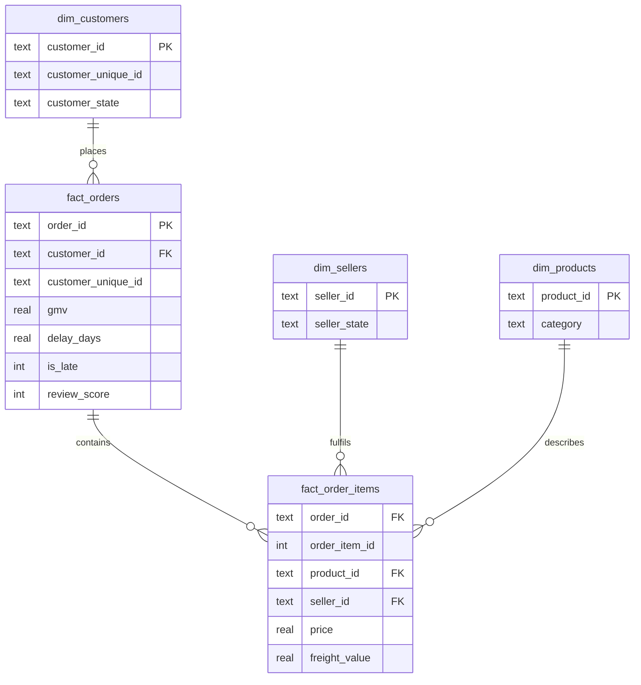

# Star Schema

```mermaid
erDiagram
    fact_orders ||--o{ fact_order_items : contains
    dim_customers ||--o{ fact_orders : places
    dim_sellers ||--o{ fact_order_items : fulfils
    dim_products ||--o{ fact_order_items : describes

    fact_orders {
        text order_id PK
        text customer_id FK
        text customer_unique_id
        real gmv
        real delay_days
        int is_late
        int review_score
    }
    fact_order_items {
        text order_id FK
        int order_item_id
        text product_id FK
        text seller_id FK
        real price
        real freight_value
    }
    dim_customers {
        text customer_id PK
        text customer_unique_id
        text customer_state
    }
    dim_sellers {
        text seller_id PK
        text seller_state
    }
    dim_products {
        text product_id PK
        text category
    }
```